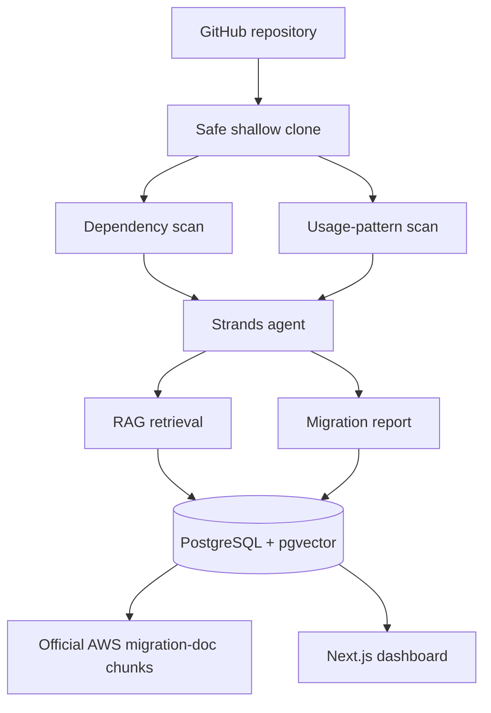

# MigrationPilot

> An autonomous AWS SDK migration auditor that identifies the AWS SDK for JavaScript v2 patterns a codebase actually uses and turns official AWS v3 migration guidance into an evidence-backed upgrade plan.

**AWS Agents for Humans Hackathon — Professional Agents**

> Status: hackathon build in progress. Benchmark values remain TBD until measured.

## The problem

AWS SDK v2→v3 migration is more than changing a package version. Developers need to locate actual v2 usage, understand modular v3 packages and behavior changes, read version-specific migration documentation, and build a safe migration sequence.

MigrationPilot combines deterministic repository inspection, RAG over official AWS migration docs, and a Strands agent so recommendations are tied to both source evidence and migration evidence.

## Workflow

```text
GitHub repo
   ↓
Detect AWS SDK v2
   ↓
Find actual v2 usage patterns
   ↓
Retrieve relevant official AWS migration guidance
   ↓
Strands agent prioritizes findings
   ↓
Evidence-backed migration plan
```

## Why an agent?

Deterministic tools inspect dependencies, locate v2 patterns, retrieve migration docs, and persist reports.

The Strands agent decides which migration topics to investigate, groups/prioritizes findings, marks manual-review cases, and orders the migration plan.

## Why RAG?

The corpus is version-specific official AWS migration documentation. When the scanner finds an API such as `AWS.DynamoDB.DocumentClient`, the agent retrieves the relevant v2→v3 guidance instead of relying only on model memory.

## Tech stack

- TypeScript
- Next.js / React / Tailwind CSS
- Strands Agents SDK
- Amazon Bedrock
- Amazon Titan Text Embeddings V2
- PostgreSQL + pgvector
- Git / simple-git
- Docker
- scheduled scan via GitHub Actions or AWS Lambda

## MVP rules

- DynamoDB DocumentClient
- AWS-context `.promise()`
- S3 v2 client construction
- S3 `getSignedUrl`
- `AWS.config.update()`
- DynamoDB DocumentClient compatibility/manual-review heuristic

## Not in hackathon scope

- arbitrary package migrations
- automated source rewriting/PRs
- MCP
- CVE feeds
- full semantic code graphs

## Architecture



## Evaluation

15 hand-labeled fixture projects measure:
- detection recall
- precision
- recommendation accuracy
- RAG Hit@3
- tool calls
- latency

| Metric | Result |
|---|---:|
| Detection recall | TBD |
| Precision | TBD |
| Recommendation accuracy | TBD |
| RAG Hit@3 | TBD |
| Avg tool calls | TBD |
| Median latency | TBD |

Never replace TBD with invented values.

## Demo repos

Primary: `AnomalyInnovations/serverless-stack-demo-api`  
Secondary: `howardmann/multer-s3-example`

Use pinned commit snapshots for reproducibility.

## Security

MigrationPilot performs read-only shallow inspection and does not run installs, tests, builds, or scripts from cloned repositories. Repo text is treated as untrusted data, and AWS credentials remain server-side.

## Getting started

Read [`START_HERE.md`](./START_HERE.md), then follow [`BUILD_PLAN.md`](./BUILD_PLAN.md).

## License

Choose MIT or Apache-2.0 and keep the repository/license metadata consistent.
