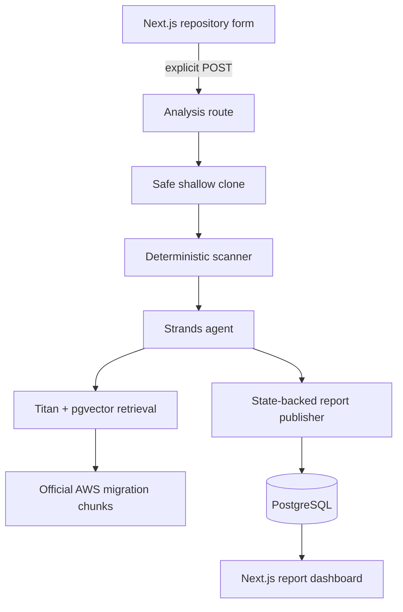

# MigrationPilot

MigrationPilot is an evidence-grounded AWS SDK for JavaScript v2 to v3 migration auditor. It safely inspects a public GitHub repository, retrieves relevant official AWS migration documentation, and publishes a reviewable migration report without executing target code.

## Problem

Moving from AWS SDK for JavaScript v2 to v3 is not a package-version bump. Applications may need modular packages, different client and command APIs, per-client configuration, and review of behavior-sensitive cases such as DynamoDB marshalling. Developers must first find the v2 patterns their repository actually uses, then connect each one to the relevant version-specific documentation.

## Solution

MigrationPilot separates facts from recommendations:

- a deterministic scanner records dependency and source evidence with exact file, line, column, snippet, severity, and confidence;
- a Strands agent decides which migration topics need investigation;
- RAG retrieves curated official AWS documentation through Titan embeddings and pgvector;
- run-scoped provenance prevents an investigation or report step from citing evidence that has not completed in the same run;
- findings without supporting guidance remain repository facts with no inferred migration behavior;
- a state-backed publisher resolves trusted IDs and generates bounded migration-plan wording deterministically.

Submitting the Analyze Repository form starts one server-side analysis. Successful publication redirects to `/reports/<reportId>`.

## Features

- Public GitHub URL validation and canonicalization
- Isolated shallow clones with time, size, entry-count, and source-file limits
- Deterministic `package.json` scanning across dependencies, devDependencies, and optionalDependencies
- Six focused AWS SDK v2 detection rules
- Exact source evidence and conservative manual-review findings
- Four-tool Strands investigation loop with a hard two-query guidance budget
- Serialized retrieval, failed-target suppression, and graceful evidence gaps
- Official AWS documentation corpus with heading-aware chunks
- Amazon Titan Text Embeddings V2 and PostgreSQL/pgvector retrieval
- Compact, run-state-backed report publication with deterministic plan prose
- PostgreSQL report persistence and responsive Next.js dashboard
- Fifteen-case hand-labeled scanner evaluation

## Architecture



The production orchestrator always cleans its temporary checkout, including failure paths. The browser receives only a report ID and canonical repository metadata; invocation state, temporary paths, credentials, and tool traces remain server-side.

## Agent design

The agent has exactly four primary tools:

1. `scan_dependencies` reads `package.json` as data and identifies v2/v3 packages.
2. `find_usage_patterns` discovers or investigates deterministic source findings.
3. `get_migration_guidance` retrieves topic-compatible official AWS evidence.
4. `publish_migration_report` accepts structured planning decisions and builds the authoritative report from same-run trusted state.

The model chooses investigation targets, evidence, plan grouping, order, and manual-review state. It does not parse source facts or author persisted migration-plan prose.

## Grounding and safety

Repository evidence and migration evidence are separate trust domains:

```text
scanner finding = what exists in this repository
retrieved AWS evidence = what can be claimed about v2 → v3 behavior
```

Evidence-driven second-hop investigation requires completed guidance chunk IDs from the same run. Unknown, fabricated, cross-run, or not-yet-completed IDs are rejected. Findings with unavailable guidance persist with empty evidence and repository-review wording that explicitly avoids replacement claims.

Each analysis permits at most two underlying guidance retrievals. Additional requests are rejected before Titan invocation, and repeated failed targets are suppressed.

## Repository safety

Target repositories are untrusted text. MigrationPilot:

- performs a shallow clone without recursive submodules;
- never runs `npm install`, lifecycle scripts, repository tests, or imported target code;
- never dynamically imports target files or `package.json`;
- scans only allowlisted JavaScript/TypeScript extensions;
- skips dependency, VCS, build, and coverage directories;
- enforces repository, file-count, and file-size limits;
- keeps AWS credentials and internal paths server-side.

## Evaluation

`npm run eval` computes metrics from 15 hand-labeled fixture repositories and writes [latest.json](./eval/results/latest.json) and [latest.md](./eval/results/latest.md).

| Metric | Measured result |
|---|---:|
| Fixtures | 15 |
| Expected findings | 18 |
| True positives | 18 |
| False positives | 0 |
| False negatives | 0 |
| Precision | 100.0% |
| Recall | 100.0% |
| F1 | 100.0% |
| Dependency classification | 100.0% |
| Manual-review classification | 100.0% |

These are deterministic-scanner results for the checked-in fixtures, not claims about arbitrary JavaScript repositories. RAG quality is not included in this local metric because query embeddings require a live AWS call.

The project currently has 102 automated tests across scanner, tool/provenance, report, repository orchestration, web integration, and evaluation suites.

## Technology

- TypeScript, Node.js 20+
- Next.js 16, React 19, Tailwind CSS
- `@strands-agents/sdk`
- Amazon Bedrock Claude
- Amazon Titan Text Embeddings V2
- PostgreSQL 16 and pgvector
- Docker Compose for local PostgreSQL

## Local setup

Prerequisites: Node.js 20+, npm, Docker, Git, and an AWS profile with access to the configured Bedrock models.

```bash
npm install
docker compose up -d
docker compose exec -T postgres psql -U migrationpilot -d migrationpilot < db/schema.sql
cp .env.example .env.local
```

The checked-in local database defaults match `compose.yaml`. Set `DATABASE_URL` explicitly for any other database.

The RAG corpus must be ingested once before live analysis. Ingestion invokes billable Titan embeddings, so review the printed chunk and call counts before running:

```bash
AWS_PROFILE=your-aws-profile \
AWS_REGION=us-east-1 \
npx tsx scripts/rag-ingest.ts
```

Start the web application:

```bash
AWS_PROFILE=your-aws-profile \
AWS_REGION=us-east-1 \
npm run dev
```

Open `http://localhost:3000`. `/reports/demo` is local and makes no AWS calls. Submitting the repository form starts one live analysis and may incur Bedrock charges.

Useful local checks:

```bash
npm test
npm run eval
npm run build
```

## Real-repository validation

The production flow has completed successfully against `AnomalyInnovations/serverless-stack-demo-api` at commit `755e2e49dd0a69556b39249b57f5db54b4ae893e`. See [real repository notes](./docs/REAL_REPOSITORIES.md) for intended secondary validation cases and reproducibility guidance.

## Deployment

Live analysis needs Git, a writable temporary filesystem, outbound GitHub/AWS access, PostgreSQL/pgvector, server-side AWS credentials, and enough request duration for clone, retrieval, inference, and publication. A long-running container or VM is a better baseline than a short-lived serverless function. See [deployment guidance](./docs/DEPLOYMENT.md).

## Known limitations

- The scanner uses conservative text and context analysis rather than a full JavaScript semantic model.
- The rule catalog covers six AWS SDK v2 patterns, not every service or API.
- The RAG corpus is intentionally limited to curated official AWS migration pages.
- Guidance may be unavailable for a valid finding; those findings remain fact-only.
- Only public GitHub repository roots are accepted.
- The current development environment uses local PostgreSQL/pgvector.
- Live analysis is synchronous and best suited to controlled single-user use until a job boundary is added.

## Screenshots

Capture locations and a checklist are maintained in [docs/screenshots](./docs/screenshots/README.md). The local demo report is available at `/reports/demo`.

## Project documentation

- [Technical design](./DESIGN.md)
- [Rule catalog](./docs/RULE_CATALOG.md)
- [Evaluation method and failure log](./EVALUATION.md)
- [RAG corpus](./docs/RAG_CORPUS.md)
- [Demo walkthrough](./docs/DEMO.md)
- [Deployment guidance](./docs/DEPLOYMENT.md)

## License

[MIT](./LICENSE)
